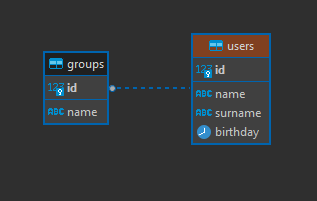

# Première compétence MySQL

SQL est un langage de requête qui permet de récupérer, modifier, supprimer et créer des données dans une base de données.
PHP Data Objects (PDO) est une extension PHP qui définit une interface pour accéder à une base de données depuis PHP.
Les requêtes SQL et PDO sont très similaires, la seule différence est que PDO permet d'utiliser des variables dans les requêtes.
Pour cet exemple, je vais créer et utiliser une base de données nommée db_users. Cette base contiendra 2 tables : users et groups.
La table users contient des informations sur les utilisateurs. Tant dis que la table groups contient des informations sur les différens groupes.
Nos deux tables sont liées par l'id de la table users et l'id de la table groups.


### Requête de connexion à la base de données.

La requete de connexion à la base de données est très simple. Il suffit de créer un objet PDO avec les paramètres suivants : le nom du serveur, le nom de la base de données, le nom d'utilisateur et le mot de passe. Pour me connecter à ma base de données, j'utilise des variables pour stocker les informations de connexion, mais vous pouvez directement les mettre dans la requête. Pour faire en sorte
de pouvoir modifier les informations de connexion sans avoir à modifier le code.
```php linenums="1"
<?php
$host = 'localhost';
$dbname = 'db_users';
$username = 'db_users_admin';
$password = '3da!4f5g?h7@';

$pdo = new PDO("mysql:host=$host;dbname=$dbname", $username, $password);
?>
```


## Requête SQL utilisée pour la création de la base de données.
```sql linenums="1"
CREATE DATABASE `db_users` /*!40100 DEFAULT CHARACTER SET utf8mb4 COLLATE utf8mb4_general_ci */;
USE `db_users`;


CREATE TABLE `groups` (
  `id` int(11) NOT NULL AUTO_INCREMENT,
  `name` varchar(30) NOT NULL,
  PRIMARY KEY (`id`)
) ENGINE=InnoDB DEFAULT CHARSET=utf8mb4 COLLATE=utf8mb4_general_ci;


CREATE TABLE `users` (
  `id` int(11) NOT NULL AUTO_INCREMENT,
  `name` varchar(30) DEFAULT NULL,
  `surname` varchar(30) DEFAULT NULL,
  `birthday` date NOT NULL,
  PRIMARY KEY (`id`)
) ENGINE=InnoDB DEFAULT CHARSET=utf8mb4 COLLATE=utf8mb4_general_ci;
```

### Exemple de requête PDO pour récupérer des données.
``` php
<?php

$sql = "SELECT * FROM users WHERE id = 1";
$stmt= $pdo->prepare($sql);
$stmt->execute();
$result = $stmt->fetch();

?>
```

### Requête SQL pour insérer des données en PDO.
```php
<?php
  // Récupérer les valeurs 
  $firstname = $_POST['firstname'];
  $lastname = $_POST['lastname'];

  // Requête mysql pour insérer des données
  $sql = "INSERT INTO `users`(`firstname`, `lastname`) VALUES (:firstname,:lastname)";
  $res = $pdo->prepare($sql);
  $exec = $res->execute(array(":firstname"=>$firstname,":lastname"=>$lastname));
?>
```

### Exemple de requête PDO pour modifier des données.
```php
<?php
$data = [
    'name' => 'John',
    'id' => 1,
];
$sql = "UPDATE users SET name = :name WHERE id = :id";
$stmt= $pdo->prepare($sql);
$stmt->execute($data);
?>
```

### Exemple de requête PDO pour supprimer des données.
```php
<?php
$data = [
    'id' => 1,
];
$sql = "DELETE FROM users WHERE id = :id";
$stmt= $pdo->prepare($sql);
$stmt->execute($data);
?>
```

### Exemple de requête PDO pour créer une base de données.
```php
<?php
$sql = "CREATE DATABASE IF NOT EXISTS `my_database` DEFAULT CHARACTER SET utf8 COLLATE utf8_general_ci;";
$stmt= $pdo->prepare($sql);
$stmt->execute();
?>
```

### Exemple de requête PDO pour créer une table.
```php
<?php
$sql = "CREATE DATABASE IF NOT EXISTS `my_database` DEFAULT CHARACTER SET utf8 COLLATE utf8_general_ci;
USE `my_database`;

CREATE TABLE IF NOT EXISTS `users` (
  `id` int(11) NOT NULL AUTO_INCREMENT,
  `name` varchar(255) NOT NULL,
  `surname` varchar(255) NOT NULL,
  `sex` varchar(255) NOT NULL,
  PRIMARY KEY (`id`)
) ENGINE=InnoDB DEFAULT CHARSET=utf8;";
$stmt= $pdo->prepare($sql);
$stmt->execute();
?>
```
